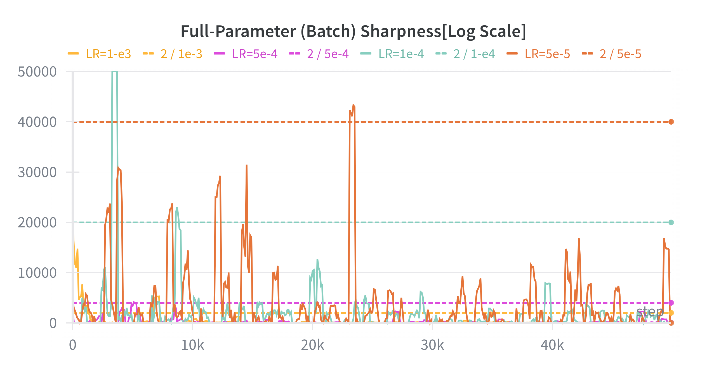
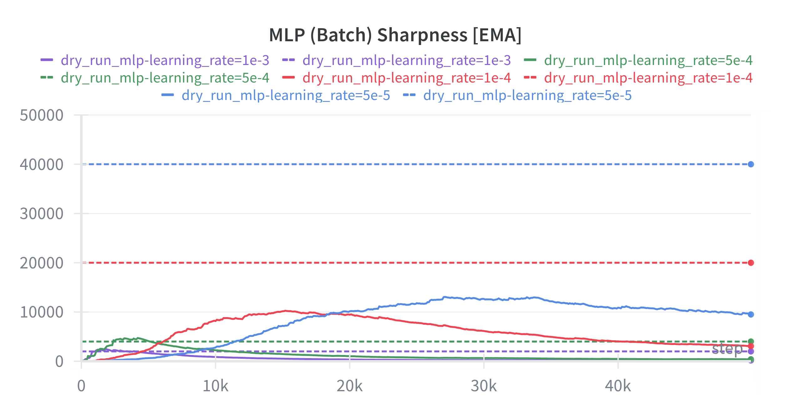
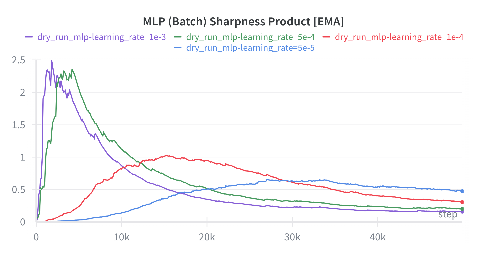

# An Edge of Stability For Language Model Post-Training

The **"Edge of Stability" (EoS)** phenomenon is a recently observed [@EoS] pattern in the optimization of deep neural nets, wherein the realized training trajectory of the model gravitates toward a narrow band on the edge between stability and catastrophic divergence. The following blog post investigates whether this phenomenon, originally established for pre-training of relatively simple MLP and CNN-style networks, persists in a new setting: *language model post-training*. We in particular study the behavior of training on an instruction tuning target, a key step in alignment which is greatly under-explored in the context of EoS. We give a background, introduce relevant literature, and explore the training dynamics on an established instruction tuning dataset, tracking relevant metrics to visualize the learning trajectory.

## Background: Learning at the Edge of Stability

EoS refers in particular to a pattern in the *sharpness* of the loss landscape throughout training. The *sharpness* of the loss landscape at a given training step is defined as the largest Hessian eigenvalue for Hessian $$\mathcal{H} = \nabla^2_\theta \mathcal{L}(\theta).$$

The first major observation in the EoS literature is that this sharpness quantity  $\lambda_{\max}$ begins relatively low and steadily increases throughout early training. This phase has been given the name of **"progressive sharpening" (PS)** [@EoS]. In particular, PS continues until the sharpness has reached a threshold value $\lambda_{\max} \approx 2 / \eta$, for current learning rate $\eta$. Once this threshold has been reached, the learning dynamics enter the **Edge of Stability (EoS)** phase.

During the EoS phase, behavior is characterized by a few key observations:

- The sharpness $\lambda_{\max}$ fluctuates around the threshold value $\lambda_{\max} \approx 2 / \eta$.
- The loss continues to decrease non-monotonically.
- The gradient norm $\|\nabla_\theta \mathcal{L}(\theta)\|$ also fluctuates around a constant value.

These three behaviors largely disagree with established optimization theory. Under a quadratic approximation to our loss function, classical optimization theory tells us that gradient descent is no longer stable and will begin to oscillate chaotically and diverge. That is, when the sharpness reaches the threshold value $\lambda_{\max} \approx 2 / \eta$, gradient descent enters a positive feedback loop inducing exploding gradient magnitudes and model divergence.

Nonetheless, the EoS phenomenon is observed in practice and in some sense implies that there is something fundamentally broken between the assumptions of classical optimization theory and the true nature of these large, nonlinear, nonconvex, stochastic systems. Deep networks seem to *self-organize* at the EoS, and somehow this behavior leads to (empirically) improved generalization in the resulting models [@EoS].

### EoS and Model Architecture

EoS has been observed in a variety of deep learning architectures including standard both feedforward and CNN-style networks in the original paper [@EoS]. Beyond the conclusions of the original work, later work [@EoStransformers] investigates the phenomenon by studying sharpness dynamics in transformer training on a block-by-block basis (i.e., averaging sharpness across all layers for a given type of block). Notably, authors observe that the sharpness dynamics are not uniform across the block and in fact each block type exhibits its own unique sharpness threshold and local EoS. The call this the **sharpness disparity principle** and leverage this principle to motivate *blockwise learning rates*, accelerating LLM training. This suggests that EoS is not a niche phenomenon but instead an intrinsic emergent property under the learning dynamics of deep neural networks and in particular transformer-style networks as well.

### EoS and Optimizers

Another heavily explored axis in the EoS literature is the role of the *optimizer*. In particular, [@EoSS] revisits the EoS idea in the context of optimizing with SGD, since [@EoS] focuses only on the batch GD case and considers only the *full-batch* (spectral) Hessian sharpness. Authors study the **batch sharpness** given by:

$$\text{Batch Sharpness}(\theta) = \frac{\mathbb E _{B \sim \mathcal P_B}[\nabla L_B(\theta)^\top \mathcal H (L_\mathbf B) \nabla L_B(\theta)]}{\mathbb E _{B \sim \mathcal P_b}[\| \nabla L_\mathbf B (\theta) \|^2]}$$

And track this metric as a function of training progress. The result is that this batch sharpness quantity reaches a similar $ 2 / \eta $ threshold as the full-batch sharpness in [@EoS] while the batch sharpness under SGD settles at a lower value than the $ 2 / \eta $ threshold. Authors argue that especially for smaller batch sizes, the **Edge of (Stochastic) Stability (EoSS)** phenomenon is largely governed by this batch sharpness quantity instead of the full-batch sharpness.

Similar work analyzes the emergence of EoS in the context of *adaptive gradient methods* [@AEoS]. In this work the authors analyze the EoS dynamics when using adaptive gradient methods such as Adam and rmsprop, confirming typical EoS dynamics when operating with "frozen" Adam (preconditioned, no dynamic updates to the preconditioner). Interestingly, authors discover a new regime of training where the sharpness of the *preconditioned* Hessian $P^{-1} \mathcal H$ (for given preconditioning matrix $P$) governs what they call the **Adaptive Edge of Stability (AEoS)**. During this regime, the *raw* sharpness quantity $\lambda_{\max}$ *continues to rise*, even beyond the original $2 / \eta$ threshold. It is this preconditioned sharpness quantity that reaches a threshold

$$\lambda_1(P^{-1} \mathcal H) \approx \frac{(2 + 2 \beta_1)}{(1 - \beta_1)\eta}$$

(for relevant Adam hyperparameter $\beta_1$) and oscillates throughout the AEoS phase.

### Post-Training and Relevance to EoS

The idea of *post-training* was largely introduced in [@sft] for the context of instruction tuning. The authors of the work take a language model *pre-trained* on a large, general text corpus for text understanding and subject it to a second leg of training, this time on a new dataset with a new goal, i.e. instruction following. Generally, this *task shift* in tandem with the shift in the *data distribution* corresponds with a *sharper* loss landscape than the original pre-training phase and in a practical sense it motivates the use of much smaller learning rates for post-training compared to pre-training.

Post-training offers a particularly unique loss landscape which is grounded in practice and has strong implications for the EoS phenomenon thanks to biases towards better generalization performance [@implicitbias]. Despite this, the EoS phenomenon has not been studied in the context of post-training.

## Motivation, Hypothesis, and Experiment Design

The main motivation behind this work is the glaring gap in the literature regarding the analysis of an additional axis: the *data distribution* itself. Presented literature covers the behavior of EoS in a variety of settings, but none of them explore the impact of a *distribuition* or even *task* shift on the EoS phenomenon.

To that end, this project narrows in particularly on the task of *language model post-training* (LMPT), where the goal is to improve the generalization performance of a pre-trained language model on a downstream task by fine-tuning it on a small amount of task-specific data. In particular, this work studies whether we observe an EoS phenomenon in the instruction tuning stage of language model alignment, experimenting with the Alpaca dataset [@alpaca].

### Hypotheses and Experiment Design

At a high level, we hypothesize that, if EoS is truly an instrinsic phenomenon of deep learning, we should *continue* to observe similar behavior patterns for LMPT. The impact of a distribution shift could potentially be significant enough to entirely alter the learning dynamics, but we expect the EoS phenomenon to persist.

To isolate the fine-tuning dynamics, we borrow the openly available **Pythia** [@pythia] suite of pre-trained language models. These models largely follow the proven architecutre recipe of GPT-3 [@gpt3]. Importantly, these models have *not* seen any form of instruction or otherwise fine-tuning updates, and are trained exclusively on the Pile [@pile1] [@pile2]. These models were chosen for the purpose of providing a clean baseline language model for this study of EoS dynamics.

We chose to fine-tune the models using the Alpaca dataset [@alpaca], which is a dataset of 52002 instruction-following examples, some including "input" fields for chat-style interaction. This dataset is established in the literature as a standard dataset for instruction tuning and alignment of language models.

To broaden the range of post-training situations we also repeat experiments using **Low-Rank Adaptation (LoRA)** [@lora] for parameter-efficient fine-tuning (PEFT). This method reduces the amount of trainable parameters for the fine-tuning run by learning only a low-rank decomposition of the full parameter matrix. We include this method to study the impact of practical changes to the fine-tuning formula on the EoS phenomenon.

Training runs were performed using rented compute resources from the rental platform [Vast.ai](https://vast.ai/), which was used to rent a single 4090 instance for experiments over the course of about 40-60 hours of compute time. We optimize using SGD while sweeping the learning rate from small (used in practice, $\sim 1e^{-4}$) to large (practically inapplicable, $\sim 1e^{-2}$) values. There is a fixed momentum of $0.9$ used for all runs as well as a fixed L2 weight decay of $1e^{-4}$.

Due to memory constraints, we were unable to perform batch GD experiments to study the impact of full-batch GD on the EoS phenomenon in LMPT. Therefore, we only report the batch sharpness metric from [@EoSS] for comparison, in place of the spectral sharpness metric from the original work [@EoS] (note: we *did* calculate this for short experiments, but the results followed the rest of the quantites and the others were much easier to compute at larger scale). We use a fixed effective batch size of $16$ for all runs, achieved with $4$ steps of accumulation with batch size $4$.

Experiments were conducted for 50000 training steps on a 5000-sample subsample of the Alpaca dataset [@alpaca], and we report the batch sharpness metric from [@EoSS] for comparison as well as the product $\lambda_{\max} \cdot \eta$ for clear comparison to the expected threshold value of $2$.

Due to some surprising initial results, we ran an additional baseline using an MLP to replicate established results from [@EoS].

## Results

### Note: On The Sharpness Calculation

A problem commonly faced by work in EoS is the computatoinal cost of the sharpness calculation. The original work [@EoS] gets around this issue using Hessian-vector products to avoid realizing the full Hessian matrix, a strategy that we largely borrow in this work. Since we are also working with quite low batch sizes (again due to memory constraints), we use this same strategy to calculate the *batch sharpness* metric from [@EoSS].

The sharpness calculation is performed by taking a Hessian-vector product and calling a standard implementation of Lanczos iteration to compute the largest eigenvalue of the Hessian.

### Experimental Results

Experimental results are presented below. Notably, we observe a clear *lack* of EoS emergence in the post-training phase of language models. That is, it appears that the batch gradient signal applicable and used in much of the EoS literature is overrun by noise in the post-training phase.

{width=75%, align=center, text-align=center}

{width=75%, align=center, text-align=center}

The above pair of figures show the raw batch sharpness quantity (solid lines) plotted against the target threshold (dashed lines) in the first figure as well as the product $\lambda_{\max} \cdot \eta$ in the second figure.  Our characterization of "EoS" in this case *should* look like the quantities in the first figure rising to the dashed lines, and the values in the second figure rising to $2$.

Notably, we observe behavior which unmistakably does *not* follow this pattern. In fact, the sharpness fluctuates by several orders of magnitude (including reaching negative values several times), and the product $\lambda_{\max} \cdot \eta$ never stabilizes at $2$.

This result goes against the hypotheses as we are seeing a complete lack of EoS emergence in the post-training phase of language models, beyond just a muted one.

The below pair of figures shows these same quantities, but tracked for the experiments using a set of LoRA adapters of rank $8$ targeting all modules.

{width=75%, align=center, text-align=center}

{width=75%, align=center, text-align=center}

It is once again visibly clear that the EoS phenomenon does not emerge in the post-training phase of language models, even when using a parameter-efficient method of fine-tuning. This implies that there is some fundmental difference between the fine-tuning phase and the post-training phase of language models, at least at the level of the batch gradient signal.

The same target behavior was expected for the LoRA experiments as was expected for the full model experiments, but the same behavior was not observed. The plots of these two quantities seem to be mostly dominated by random noise, contradicting the notion of the batch sharpness as a reliable metric for characterizing the EoS phenomenon in the context of large language models.

Due to the surprising nature of these initial results, we ran an additional baseline using an MLP to replicate established results from [@EoS]. Notably, we see a clear pattern of progressive sharpening, with the product $\lambda_{\max} \cdot \eta$ clearly rising as training progresses at first. However, this quantity *also* does not reach the target value of 2, which could be due to numerical instability (see Conclusion). Due to compute and time constraints, *all experiments* were ran to 50,000 iterations; however, while the MLP experiments show clear signs of progressive sharpening, the true EoS phase is not reached in the fixed step budget. Graphs are below.

{width=75%, align=center, text-align=center}

{width=75%, align=center, text-align=center}

Comparing the visuals of the MLP experiments to the language model experiments, it is clear that the batch sharpness metric is not a reliable metric for characterizing the EoS phenomenon in the context of large language models. Nonetheless, there remained one more metric to try: the **interaction-aware sharpness** as defined in [@ias]. This metric seeks to remove the impact of batch size interactions with the gradient landscape by using monte carlo to get a stronger estimate of true sharpness. We reran experiments for a final time, tracking the interaction-aware sharpness metric for both the full model and LoRA experiments. Graphs are below.

{width=75%, align=center, text-align=center}

{width=75%, align=center, text-align=center}

As you can see, this *most robust* quantity *still* fails to reveal signs of EoS. With all this in mind, we can make some conclusions about an EoS phenomena for post-training.

## Conclusion

Overall, the results of this experiment suggest that the EoS phenomenon does **not occur** in the context of LMPT. However, we acknowledge limitations and hesitate to make such a strong claim without further (planned) experimentation and analysis. In particular, we acknowledge that the calculation of metrics for this project, simply due to the nature of these models being multi-millions of parameters large, is heavily susceptible to numerical instability and noise. We hope to reproduce these experiments at a larger scale to rule out the possibility of numerical instability.

We additionally acknowledge that the fact none of our existing metrics behaved how we might expect *doesn't necessarily* mean that there *exists* no robust metric that will, unifying these sub-phenomena into a single, unified EoS phenomenon. Future work should explore this possibility.

Finally, we acknowledge that we fail to analyze these dynamics in the *batch GD* context of the original work. Although these results heavily suggest a no-EoS post training phase, future work should explore the dyanamics of batch GD on this problem.

To conclude, we must *continue* to look for the signs of edge of stability in LMPT, as these results point to the problem setting bringing along with it some new dynamics that we have yet to fully understand.

### References
